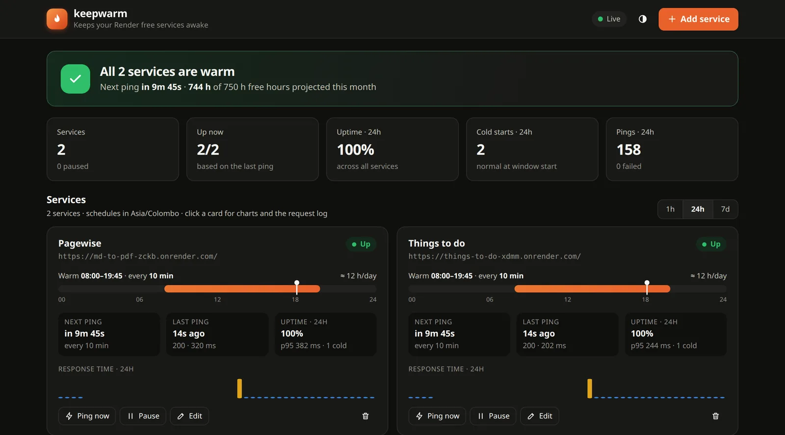
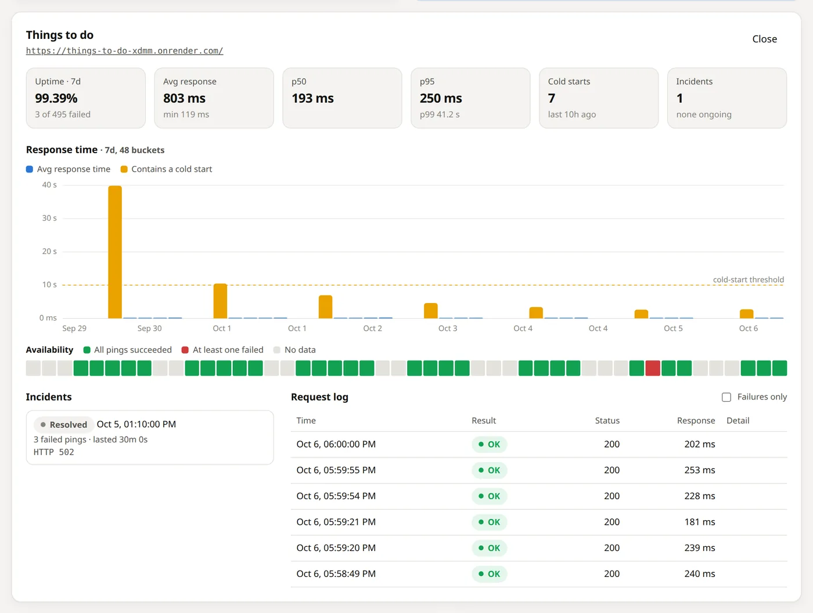
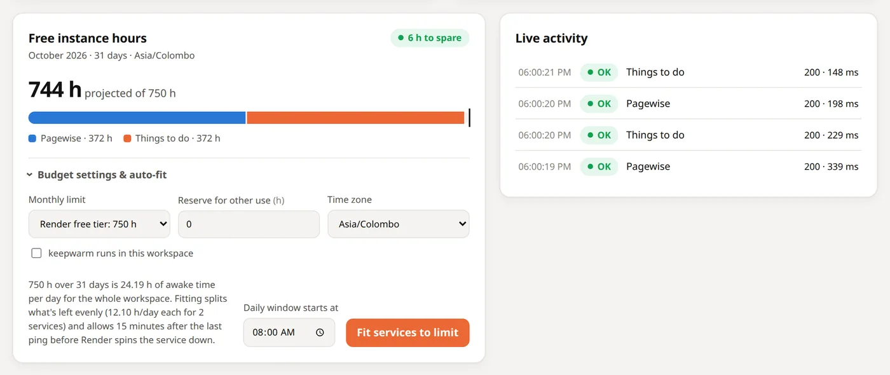
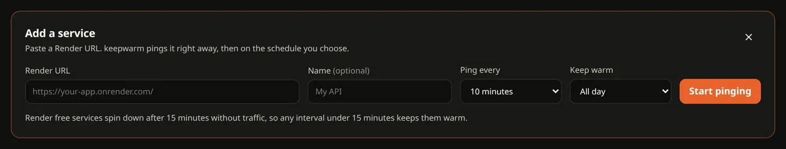
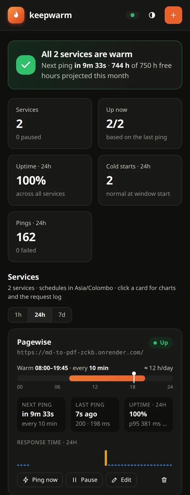
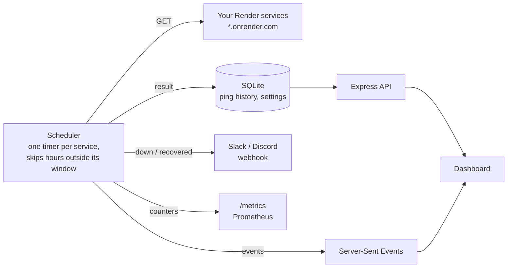

<p align="center">
  
</p>

<h1 align="center">keepwarm</h1>

<p align="center">
  Keep your Render free web services awake, so visitors never wait a minute for a cold start.<br>
  Pings your apps on a schedule you choose, shows every request it makes, and keeps you inside Render's 750 free instance hours.
</p>

<p align="center">
  <a href="https://keepwarm-t741.onrender.com"><strong>Live dashboard →</strong></a> <sub>(password-protected)</sub>
  <br><br>
  <a href="#features">Features</a> ·
  <a href="#screenshots">Screenshots</a> ·
  <a href="#how-it-works">How it works</a> ·
  <a href="#staying-within-the-free-instance-hours">Free hours</a> ·
  <a href="#run-it-locally">Run locally</a> ·
  <a href="#deploy">Deploy</a> ·
  <a href="#api">API</a>
</p>

<p align="center">
  
  
  
  
  
</p>



## Why

Render's free web services spin down after **15 minutes without inbound traffic**, and the next visitor waits about a minute while the service starts again. keepwarm sends a request before that happens, so the service never goes to sleep.

Keeping a service awake isn't free either: every hour it's awake counts against the workspace's **750 free instance hours a month**. One service awake 24/7 uses 744 h in a 31-day month, so two are already over the limit. keepwarm lets you keep services warm only during the hours that matter (e.g. 08:00–19:45) and shows exactly how many hours that will use.

## Features

### Keeping services warm

| Feature | What it does |
| --- | --- |
| **Scheduled pings** | Any number of `*.onrender.com` URLs, each with its own interval (1–60 min). The first ping happens as soon as you add the service. |
| **Daily windows** | Keep a service warm only between set hours, e.g. 08:00–19:45, in the time zone you choose. Outside its window a service shows **Asleep** and isn't pinged. |
| **Free-hour budget** | Pick your monthly instance-hour limit (Render free = 750 h), see projected usage on a meter, and fit every service into it with one click. |
| **Interval warnings** | Choosing 15 minutes or more warns you that Render will still put the service to sleep between pings. |
| **Ping now** | Send a request on demand. Outside a service's window it asks first, because waking the service uses free hours. |

### Monitoring

| Feature | What it does |
| --- | --- |
| **Status at a glance** | A banner says what's happening right now: all warm, asleep until 08:00 (with a countdown), a service down, or projected hours over the limit. |
| **Service cards** | A 24-hour timeline of each keep-warm window with a "now" marker, next and last ping, uptime, p95 and a response-time sparkline. |
| **Service detail** | Uptime, average/p50/p95/p99 response time, a response-time chart with the cold-start threshold, an availability strip, incidents and a searchable request log (1h / 24h / 7d). |
| **Cold-start detection** | A successful ping slower than 10 s (configurable) is flagged as a cold start. |
| **Live activity** | Every ping is streamed to the dashboard over Server-Sent Events as it happens. |
| **Alerts** | Slack or Discord message when a service goes down and when it recovers. |
| **Prometheus metrics** | `/metrics` exposes ping counts, latency histograms, cold starts and up/down state per service. `/healthz` for health checks. |

### Across the app

- **Light and dark themes** that follow your system, with a toggle, and a layout that works down to small phones.
- **Optional password protection** for the dashboard, API and metrics: a sign-in page for the browser, HTTP Basic auth for scripts.
- **Safe by default on public instances:** only `*.onrender.com` URLs are accepted unless you opt in, so keepwarm can't be used to send requests to arbitrary hosts.
- **Tiny footprint:** one runtime dependency (Express). Storage is SQLite through Node's built-in `node:sqlite`, and the frontend is plain JavaScript with no build step.

## Screenshots

<table>
  <tr>
    <td width="50%"><br><sub><b>Service detail:</b> the morning cold start stands out on the chart, and yesterday's 30-minute outage shows up on the availability strip and as an incident.</sub></td>
    <td width="50%"><br><sub><b>Free instance hours:</b> projected usage per service against the 750 h limit, and auto-fit. Live activity on the right.</sub></td>
  </tr>
  <tr>
    <td colspan="2"><br><sub><b>Add a service:</b> URL, interval and an optional daily window.</sub></td>
  </tr>
</table>

<p align="center">
  <br>
  <sub>On a phone, cards stack and the header collapses to icons.</sub>
</p>

## How it works



- Each service has its own timer. The next ping is due one interval after the last one, so restarts don't cause a burst of requests. Outside a service's daily window the timer simply waits until the window opens.
- Every request is recorded with its status code, response time and error. Statistics, charts and incidents are computed from that history, which is kept for 7 days by default.
- When keepwarm itself runs on Render, it also pings its own `/healthz` every 10 minutes so it doesn't fall asleep.

### Choosing an interval

| Interval | Effect |
| --- | --- |
| 1–14 min | The service stays awake. 10 min is a good default; 14 min uses the fewest requests. |
| 15+ min | Render puts the service to sleep between pings, so you'll still get cold starts. The dashboard warns you. |

## Staying within the free instance hours

Render gives each workspace **750 free instance hours per month**, and a service uses them whenever it's awake. When they run out, Render suspends the workspace's free services until the next month.

The **Free instance hours** card handles this:

- **Monthly limit**: *Render free tier: 750 h*, or a custom number.
- **Reserve for other use**: hours to set aside for real traffic outside keepwarm's windows. Every visit outside a window wakes the service for at least 15 minutes.
- **Time zone**: the zone daily windows and month boundaries are evaluated in.
- **keepwarm runs in this workspace**: tick this if keepwarm itself is a free service in the same workspace (it then counts 24 h/day).
- **Fit services to limit** splits the available hours evenly between the active services and gives each a daily window starting at the time you pick. Two services in a 31-day month get **08:00–19:45** each (2 × 12 h × 31 = 744 h ≤ 750). Shorter months get longer windows.

Usage is estimated as *window length + 15 minutes* per day, because Render spins a service down 15 minutes after its last request.

## Tech stack

| Layer | Technology | Used for |
| --- | --- | --- |
| Server | **Node.js 24**, **Express 5** | HTTP server, JSON API, static files |
| | `fetch` + `AbortSignal.timeout` | Pings, with a 90 s timeout to allow for cold starts |
| Storage | **SQLite** via built-in `node:sqlite` | Services, ping history, settings |
| Live updates | **Server-Sent Events** | Streaming each ping result to the dashboard |
| Time zones | `Intl.DateTimeFormat` | Daily windows and month boundaries in any IANA zone |
| Frontend | **Vanilla JavaScript** (ES modules), inline SVG | Dashboard, charts and icons, no framework and no build step |
| Observability | **Prometheus** text format, Slack/Discord webhooks | `/metrics` and down/recovered alerts |
| Tests | `node:test` | 36 tests, run in GitHub Actions on every pull request and push to `main` |
| Deployment | **Docker**, **Render** blueprint | Any always-on host, or Render's free tier |

## Run it locally

Requires **Node.js 22.13+** (24 recommended).

```bash
git clone https://github.com/akindu-k/keepwarm.git
cd keepwarm
npm install
npm start
# open http://localhost:3000
```

Paste a Render URL such as `https://md-to-pdf-zckb.onrender.com/`, choose an interval and click **Start pinging**. `npm run dev` restarts on file changes, and `npm test` runs the test suite.

### Configuration

Copy `.env.example` to `.env`; `npm start` loads it automatically.

| Variable | Default | Purpose |
| --- | --- | --- |
| `PORT` | `3000` | HTTP port |
| `DB_PATH` | `data/keepwarm.db` | SQLite database file |
| `DASHBOARD_PASSWORD` | none | If set, the dashboard shows a sign-in page (sessions last 30 days), and the API and `/metrics` also accept HTTP Basic auth (any username). `/healthz` stays public. |
| `SEED_MONITORS` | none | `url=minutes[@HH:MM-HH:MM]`, comma-separated, created on startup if missing |
| `MONTHLY_HOUR_LIMIT` | `750` | Default monthly instance-hour limit for the budget card |
| `TIMEZONE` | viewer's zone | Default IANA time zone for daily windows, e.g. `Asia/Colombo` |
| `COUNT_SELF` | `false` | Default for "keepwarm runs in this workspace" |
| `ALERT_WEBHOOK_URL` | none | Slack/Discord incoming webhook for down/recovered alerts |
| `COLD_START_THRESHOLD_MS` | `10000` | Successful pings slower than this count as cold starts |
| `RETENTION_DAYS` | `7` | Ping history older than this is deleted hourly |
| `REQUEST_TIMEOUT_MS` | `90000` | Ping timeout (cold starts can take ~60 s) |
| `MIN_INTERVAL_MINUTES` / `MAX_INTERVAL_MINUTES` | `1` / `60` | Allowed interval range |
| `MAX_MONITORS` | `50` | Maximum number of services |
| `ALLOW_ANY_HOST` | `false` | Allow URLs outside `*.onrender.com`. Leave off on public instances. |
| `SELF_PING_URL` | `$RENDER_EXTERNAL_URL/healthz` | Where keepwarm pings itself to stay awake |

## Deploy

keepwarm has to run somewhere that's always on, otherwise it can't ping anything. The live instance at **[keepwarm-t741.onrender.com](https://keepwarm-t741.onrender.com)** runs on Render's free tier as described below.

- **Docker (any VPS or always-on host):** `docker compose up -d --build`. Ping history is stored in the `keepwarm-data` volume.
- **Render free tier:** use the included `render.yaml` blueprint (**New → Blueprint**) and set:
  ```
  DASHBOARD_PASSWORD=<something long>
  SEED_MONITORS=https://md-to-pdf-zckb.onrender.com/=10@08:00-19:45,https://things-to-do-xdmm.onrender.com/=10@08:00-19:45
  TIMEZONE=Asia/Colombo
  ```
  Two things to know:
  1. **Put keepwarm in a separate Render workspace** from the services it keeps warm. It stays awake all day (~744 h a month), and every workspace has its own 750 h.
  2. **There's no persistent disk**, so the database is wiped whenever the instance restarts or redeploys. `SEED_MONITORS` re-creates your services on boot; the ping history starts again.

## API

Everything the dashboard does is available as JSON. If `DASHBOARD_PASSWORD` is set, send it with HTTP Basic auth (any username).

| Method & path | Description |
| --- | --- |
| `GET /api/monitors` | List services with their next ping time and last result |
| `POST /api/monitors` | Add a service: `{ "url", "name"?, "intervalMinutes", "activeStart"?, "activeEnd"? }` (window in minutes after midnight) |
| `PATCH /api/monitors/:id` | Change name, interval, window or `enabled` |
| `DELETE /api/monitors/:id` | Stop pinging and delete its history |
| `POST /api/monitors/:id/ping` | Ping now and return the result |
| `GET /api/overview?window=24h` | All services with stats and sparklines (`1h`, `24h` or `7d`) |
| `GET /api/monitors/:id/stats?window=7d` | Detailed stats, time series and incidents for one service |
| `GET /api/monitors/:id/pings?limit=50&status=failed` | Request log, newest first; pass `before=<nextBefore>` for older entries |
| `GET /api/events` | Server-Sent Events stream: `ping-start` and `ping` |
| `GET /api/budget` | Projected instance hours for the current month |
| `POST /api/budget/fit` | Fit all services into the limit: `{ "start": "08:00" }` |
| `GET` / `PUT /api/settings` | Monthly limit, reserved hours, time zone, `countSelf` |
| `GET /metrics` | Prometheus metrics |
| `GET /healthz` | Health check (always public) |

```bash
curl -u :$DASHBOARD_PASSWORD -X POST http://localhost:3000/api/monitors \
  -H 'content-type: application/json' \
  -d '{"url":"https://my-app.onrender.com/","intervalMinutes":10,"activeStart":480,"activeEnd":1185}'
```

## Project structure

```
src/
  server.js           Start-up: store, scheduler, seeding, self-ping, retention
  app.js              Express app: login, routes, static files, /healthz, /metrics
  scheduler.js        One timer per service, daily windows, records each ping
  pinger.js           A single keep-alive request with timeout
  timewindow.js       Daily windows and month boundaries in a time zone
  budget.js           Instance-hour projection and "fit to limit"
  stats.js            Uptime, percentiles, time series, incidents
  db.js               SQLite schema and queries (node:sqlite)
  alerts.js           Slack/Discord down/recovered webhook
  metrics.js          Prometheus metrics
  routes/             monitors, observability (stats, log, SSE), budget
public/
  index.html          Dashboard markup and icons
  favicon.svg         Logo, also used as the favicon (.ico and apple-touch-icon are PNG renders of it)
  styles.css          All styles, light and dark themes
  app.js              Dashboard logic, charts, live updates
test/                 node:test suites
docs/                 Screenshots
render.yaml           Render blueprint
Dockerfile, docker-compose.yml
```

## Good to know

- **The first ping of each window is a cold start.** If a service has a daily window, it's asleep overnight, so the 08:00 ping wakes it and takes up to a minute. It's warm from then on.
- **Real traffic outside a window still uses hours.** A visit at 22:00 wakes the service for at least 15 minutes. Set **Reserve for other use** to leave room for that.
- **Pinging keeps a service awake, not healthy.** A ping counts as successful for any response below 500, so a 404 page still keeps the service warm. Point keepwarm at a URL that returns quickly, such as a health route.
- keepwarm only sends `GET` requests, identified by the user agent `keepwarm/0.1 (+keep-alive ping)`.
